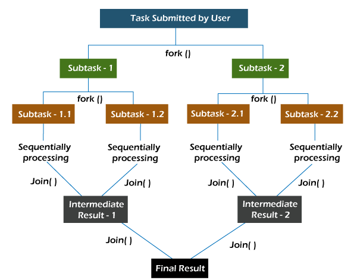

# Fork/Join Framework

> Divide y vencerás

El framework Fork-Join divide una tarea en subtareas hasta que la minitarea sea lo suficientemente simple como para resolverla sin más divisiones. Es como un algoritmo de divide y vencerás. Un concepto crucial en este marco es que ningún hilo de trabajo está inactivo. Implementan el algoritmo "work-stealing" en el que los workers inactivos roban el trabajo de aquellos workers que están ocupados.



Para ejecutar las tareas en paralelo, el framework utiliza un grupo de pool de threds, con una cantidad de threads igual a la cantidad de procesadores disponibles para la máquina virtual Java (JVM) de manera predeterminada.

Cada thread tiene su propia double-ended queue (deque) para almacenar las tareas que se ejecutarán.

Una deque es un tipo de cola que admite agregar o quitar elementos tanto del frente (cabeza) como del final (cola). Esto permite dos cosas:

Un thread puede ejecutar solo una tarea a la vez (la tarea en la cabeza de su deque).
Se implementa el algoritmo "work-stealing" para equilibrar la carga de trabajo del thread.
Con el algoritmo "work-stealing", los threads que se quedan sin tareas para procesar pueden robar tareas de otros threads que aún están ocupados (eliminando tareas de la cola de su deque).

```java
Result solve(Problem problem) {
    if (problem is small)
        directly solve problem
    else {
        split problem into independent parts
        fork new subtasks to solve each part
        join all subtasks
        compose result from subresults
    }
}
```

## Work-stealing

En pocas palabras, los threads libres intentan “robar” trabajo de las colas de los threads ocupados.

De manera predeterminada, un worker thread obtiene tareas de la cabecera de su propia deque. Cuando está vacía, el thread toma una tarea de la deque de otro thread ocupado o de la queue de entrada global, ya que es allí donde es probable que se encuentren las piezas de trabajo más grandes.

Este enfoque minimiza la posibilidad de que los threads compitan por las tareas. También reduce la cantidad de veces que el thread tendrá que buscar trabajo, ya que primero trabaja en los fragmentos de trabajo más grandes disponibles.

## ForkJoinPool

ForkJoinPool es el corazón del framework. Es una implementación de ExecutorService que administra los worker threads y nos brinda herramientas para obtener información sobre el estado y el rendimiento del thread pool.

Hay tres formas diferentes de enviar una tarea a ForkJoinPool.

- execute(): Ejecución asincrónica deseada; llame a su método fork para dividir el trabajo entre varios subprocesos.
- invoke(): Espere a obtener el resultado; llame al método de invocación en el grupo.
- submit(): Devuelve un objeto Future que puede usar para verificar el estado y obtener el resultado al finalizar.

## ForkJoinTask

ForkJoinTask es una clase abstracta para crear tareas que se ejecutan dentro de un ForkJoinPool. RecursiveAction y RecursiveTask son las únicas dos subclases directas conocidas de ForkJoinTask.

La única diferencia entre estas dos clases es que RecursiveAction no devuelve un valor, mientras que RecursiveTask sí tiene un valor de retorno y devuelve un objeto del tipo especificado.

En ambos casos, deberá implementar el método calculate() en su subclase que realiza el cálculo principal deseado por la tarea.
